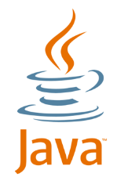

# 

# Core JAVA   
--------------------------------

- Java is an object-oriented, class-based, concurrent, secured and general-purpose computer-programming language.

## Pre Requisites : 
- C language (Loop, Array, String)
- SQL (Core SQL)
- Web Design (Javascript)

## History of Java :
- Sun Microsystem -> James Gosling , (Mike and Patrick <- Helpers)
- Java Project -(1991 - 1995) -> 1995 Launched
- 1991 <- Project Started -> Technology = GreenTalk (programming language) [.gt]
- GreenTalk -> Oak -> Java (Oak name was already registered as a Company, hence Renamed to 'Java')
- Java Symbol -> Coffee Mug
- First Version -> 1995 - Jdk 1.0 Alpha & Beta
- Oracle acquired Sun Microsystems in 2010 so now Java is owned by oracle. 
- Recent Version -> 
  - Java JDK 22 (March, 2024)
  - Java JDK 23 (Sept, 2024)   -- [JDK 23 will receive updates under these terms, until March 2025, when it will be superseded by JDK 24.]
    - java 23.0.1 2024-10-15
    - Java(TM) SE Runtime Environment (build 23.0.1+11-39)
    - Java HotSpot(TM) 64-Bit Server VM (build 23.0.1+11-39, mixed mode, sharing)

## Career Options :
- Full Stack Development
- SQL Development
- Frontend Development (Desiging)
- Andriod Development
- Game Development
- MERN Stack (MongoDB, Express Js, React, Node)
- Testing


## Features of Java :
- Simple Language
- Platform Independent Language
- Object Oriented Programming Structure/System
- Secured Programming Language (Because No Support to Pointer Concept)
- Multi-Threaded (Mostly used in Game Development)
- High Performance

## Installation :
- VS-CODE
- Sublime
- Netbeans
- Intellij
- **Eclipse IDE** - [Link](https://www.eclipse.org/downloads/) 
  - Download Installer File and Run
  - Select "Eclipse IDE for Enterprise Java and Web Developers"
  - Install
  - Launch 
  

## Getting Started :

### General Structure :
```sh
  class class_name{
    public static void main(String[] args){  
      // Main Function - Business Code
    }
  }

```
- **class** keyword is used to declare a class in Java.
- class_name : Same as the name of file.
- **public** keyword is an access modifier that represents visibility. It means it is visible to all.
- **static** is a keyword. If we declare any method as static, it is known as the static method. The core advantage of the static method is that there is no need to create an object to invoke the static method. The main() method is executed by the JVM, so it doesn't require creating an object to invoke the main() method. So, it saves memory.
- **void** is the return type of the method. It means it doesn't return any value.
- **main** represents the starting point of the program.
- **String[] args** or **String args[]** is used for command line argument. We will discuss it in coming section.


```sh
  class Welcome {   
	public static void main(String[] args) {
		System.out.println("Hello World! Welcome to Java Programming!");
	}
}
```
- **System.out.println()** is used to print statement. Here, System is a class, out is an object of the PrintStream class, println() is a method of the PrintStream class. 


