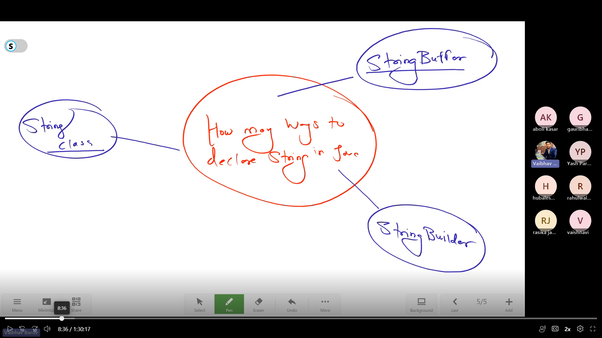
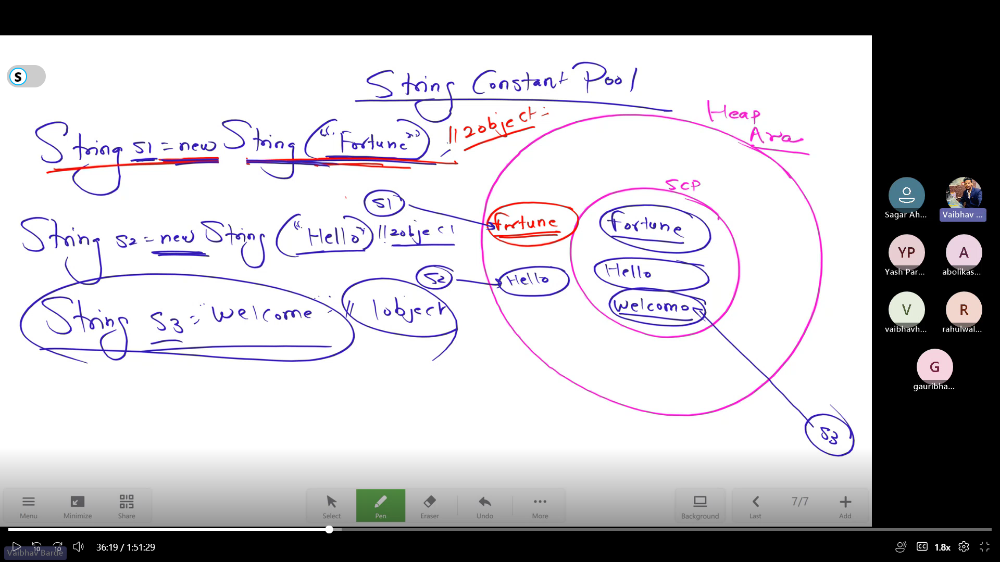
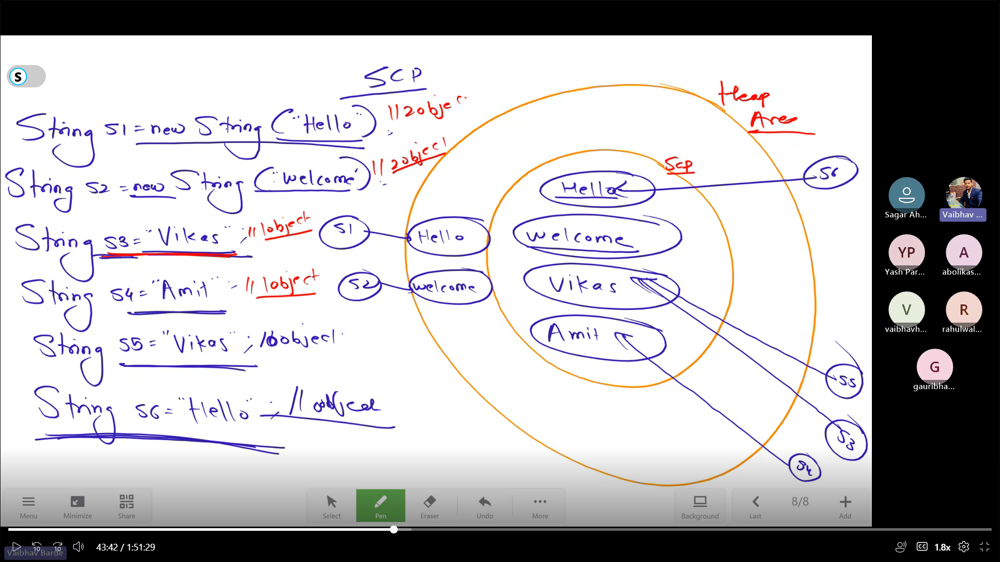
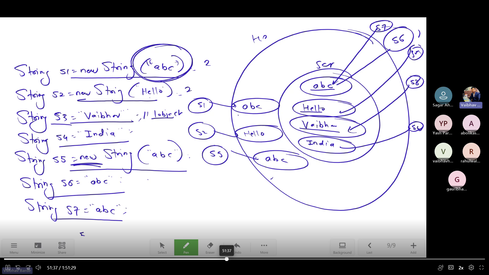
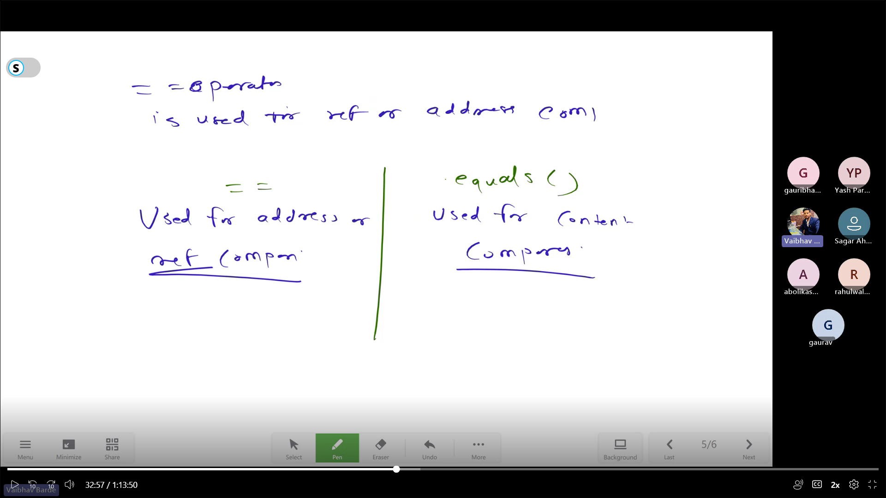
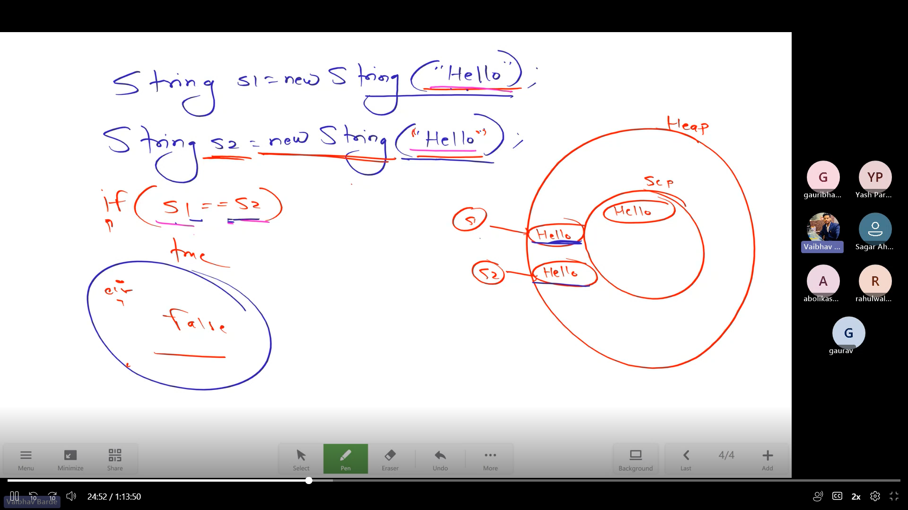
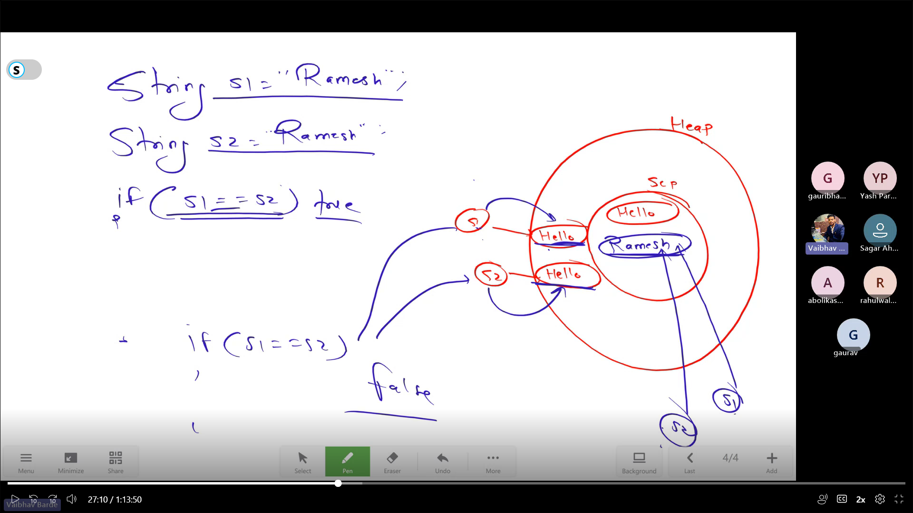
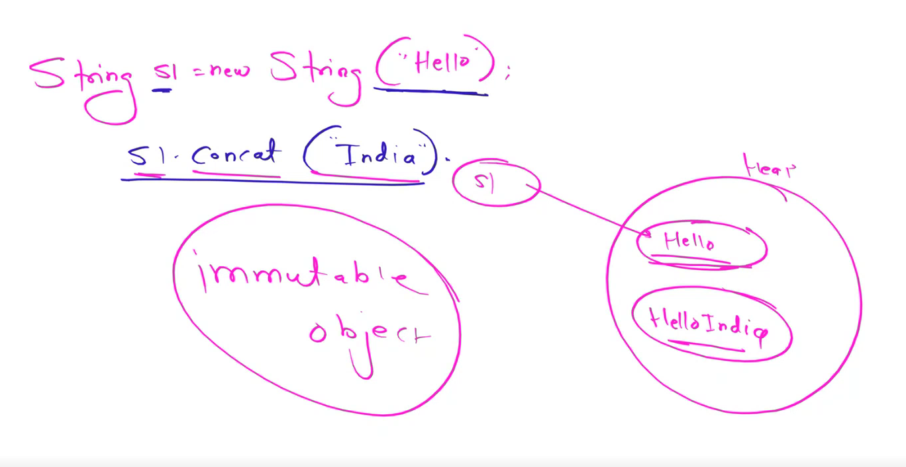
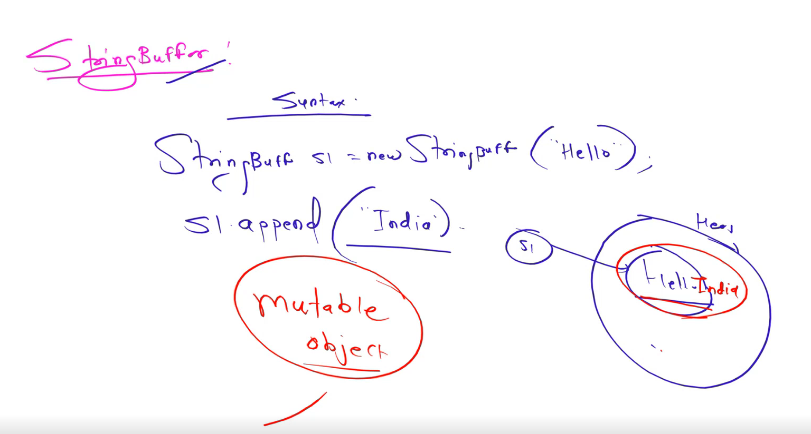

# String


- String is a non primitive datatype.
- Defn : It is a group of/collection of characters. (A sequence of array.)
- In Java - **String is a Final class (not a datatype)**.
- Sring object or Immutable object.
- Object is the parent class of all Classes in Java.

```sh
class object{
  // Methods
}

class final String extends object{
  // String Methods
}

class synchronized StringBuffer extends object{
  // StringBuffer Methods
}

class synchronized StringBuilder extends object{
  // StringBuilder Methods
}


```

# Ways to declare a String : 

1. String Class - (object, literal)
   1. String s1 = new String("Rushi");  -[Declared through object]
   2. String s2 = "Hello";  -[By Literal delaration]
	(In java Literal is better compaired to Object)
2. String Buffer
3. String Builder

## 1. String Class
```sh
String s0 = new String("Welcome");
String s1 = "Welcome";
```

#### String Constant Pool (SCP) - [Jdk 1.1 - Jdk 1.6]
SCP is a Special Memory area in which we can store only String Literals. (Fixed memory size to Strings)
- If String is declared by object
  ***String s1=new String("Hello");***  
- It will create an instance in Heap Area referred by s1 and also in SCP without any referrence.





# Methods in String

1. string_name.lenght() : Length of string.
2. string_name.toLowerCase() : all string characters to Lower Case.
3. string_name.toUpperCase() : all string characters to Upper Case.
4. string_name.trim() : Removes all extra spaces on both the extremeties not in between.
5. string_name.charAt(location) : Character at the given location in string.
6. string_name.indexOf('character') : Index of Character in the given string.

- Example :
```sh
package day8_30Aug;

public class strings {

	public static void main(String[] args) {
		// TODO Auto-generated method stub
//		String s0 = new String("Welcome");
		String s1 = "	Welcome		";

//		System.out.println(s0);
		System.out.println(s1);
		System.out.println(s1.length());
		System.out.println(s1.trim());
		System.out.println(s1.length());
		System.out.println(s1.toUpperCase());
		System.out.println(s1.toLowerCase());
		System.out.println(s1.charAt(2));
		System.out.println(s1.indexOf('o'));
		
	}

}

Output :
 Welcome		
9
 Welcome
9
 WELCOME		
 welcome		
e
5
```

7. string_name.replace('target_character','expected_character') : Replaces target_character with expected_character.
8. string_1_name.equals(string_2_name) : Checks whether both string are equal, if yes returns 'true', 'false' if not.{Case Sensitive : W != w}
9. string_1_name.equalsIgnoreCase(string_2_name) : Checks whether both string are equal, if yes returns 'true', 'false' if not.{Not Case Sensitive : W = w}
10. string_name.substring(starting_location) : Create a starting_location onwards substring from given string.
11. string_name.substring(starting_location,ending_location) : Create a starting_location till (ending_location-1)substring from given string.
- Example :
```sh
    String s1 = "Welcome";
		String s2 = "welcome";
		System.out.println(s1.replace('o','a'));
		System.out.println(s1.equals(s2));
		System.out.println(s1.equalsIgnoreCase(s2));
		System.out.println(s1.substring(2));
		System.out.println(s1.substring(2,6));

Output -
Welcame
false
true
lcome
lcom
```

- **[ == : Operator is used for Reference or Address Comparision]**

- String equality checking with '==' operator gives 'false' output. (if string are declared by object.)

- String equality checking with '==' operator gives 'true' output. (if string are declared as literal.)

- Example:
```sh
package day8_30Aug;

public class strings_equality_comparision {

	public static void main(String[] args) {
		
		String s0 = new String("Welcome");
		String s1 = new String("Welcome");
		if(s1==s0) {
			System.out.println(true);	
		}
		else {
			System.out.println(false);
		}

		String s2 = "Welcome";
		String s3 = "Welcome";
		if(s2==s3) {
			System.out.println(true);	
		}
		else {
			System.out.println(false);
		}
		
		System.out.println("=============");
		
		String s4 = new String("Welcome");
		String s5 = new String("Welcome");
		if(s4.equals(s5)) {
			System.out.println(true);	
		}
		else {
			System.out.println(false);
		}

		String s6 = "Welcome";
		String s7 = "Welcome";
		if(s6.equals(s7)) {
			System.out.println(true);	
		}
		else {
			System.out.println(false);
		}		
	}

}


Output -
false
true
=============
true
true
```


```sh
class Object{
	// Methods
	equals() -- (Check Reference, Address)
}
class final String extends Object{
	equals() -- (Content/Data check)
}
class synchronized StringBuffer extends Object{
	// No equals method. Since inherits method from Object Class.
}
```

12. string_1_name.concat(string2) : Add string 2 to the end of string1.



## 2. String Buffer 
- Only Objects, not literal
 
```sh
package day9_02Sept;

public class demo_StringBuffer {

	public static void main(String[] args) {
		StringBuffer s1 = new StringBuffer("Hello");		
		System.out.println(s1);
	}
}

Output - 
Hello
```

- String Buffer vs String Class :
```sh
	StringBuffer s1 = new StringBuffer("Hello");		
	System.out.println(s1);
	System.out.println(s1.append(" Rushi"));
	
	String s2 = new String("Welcome");
	System.out.println(s2);
	s2.concat(" Rushikesh");
	System.out.println(s2);
	s2 = s2.concat(" Rushikesh");
	System.out.println(s2);

Output - 
Hello
Hello Rushi
Welcome
Welcome
Welcome Rushikesh
```
 
### Methods in StringBuffer
  -	No "equals" method. Since inherits method from Object Class.

1. s1.capacity() : No of Characters can be stored in StringBuffer s1.
	1. Incase if string contains characters more than the capacity -> new_capacity = (old_capacity * 2) + 2
2. s1.trimtosize() : Avoid wastage of access memory.
   ```sh
		StringBuffer b0 = new StringBuffer("Hello");
		System.out.println(b0.capacity());
		b0.trimToSize();
		System.out.println(b0.capacity());
	Output -
	21
	5
	```
3. s1.reverse() : Reverse the String. 
4. s1.delete(start, end) : delete the substring.
5. s1.deleteCharAt(location) : Delete character at location.
6. s1.replace(start, end, expected_sub_string) : Replace substring from start to end with 'expected_sub_string'
   


## 3. StringBuilder 
```sh
package day9_02Sept;

public class demo_StringBuilder {

	public static void main(String[] args) {
		StringBuilder b0 = new StringBuilder("Welcome");
		
		System.out.println(b0.length());
	}

}
```


## String vs StringBuffer vs StringBuilder


| String | StringBuffer | StringBuilder |
| ---- | ---- | ---- |
| Immutable Object | Mutable Object | Mutable Object |
| 2 Memory Allocations (HeapMemory, SCP) | 1 Memory Allocations (HeapMemory Area) | 1 Memory Allocations (HeapMemory Area) |
| equals() - Overide method (Content Checking) | equals() - Object Class (Reference Check) | equals() - Object Class (Reference Check) |
| Can be Declared by new keyword and By literal | Can be Declared only by new keyword | Can be Declared only by new keyword | 
| Methods not Synchronized | Methods Synchronized | Methods not Synchronized |
| concat() | append() | append() |
| Occupy More Memory | Occupy Less Memory | Occupy Less Memory |
| Fast | Slow | Fast |
| Not Thread Safe | Thread Safe | Not Thread Safe |