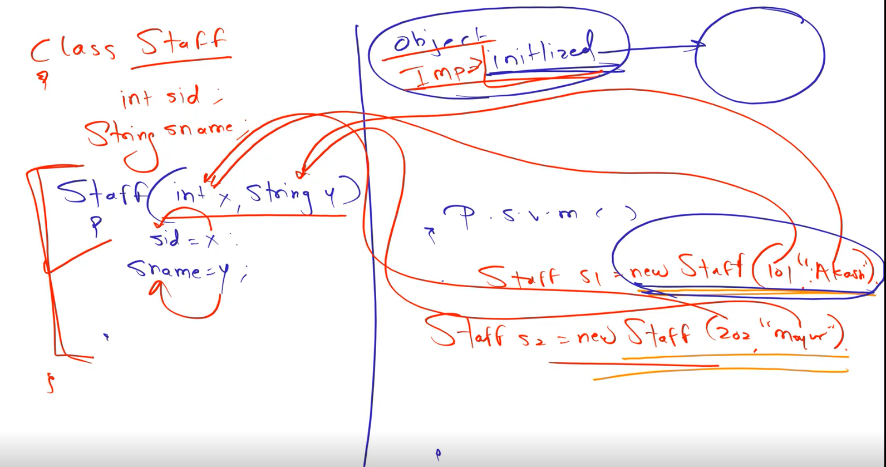
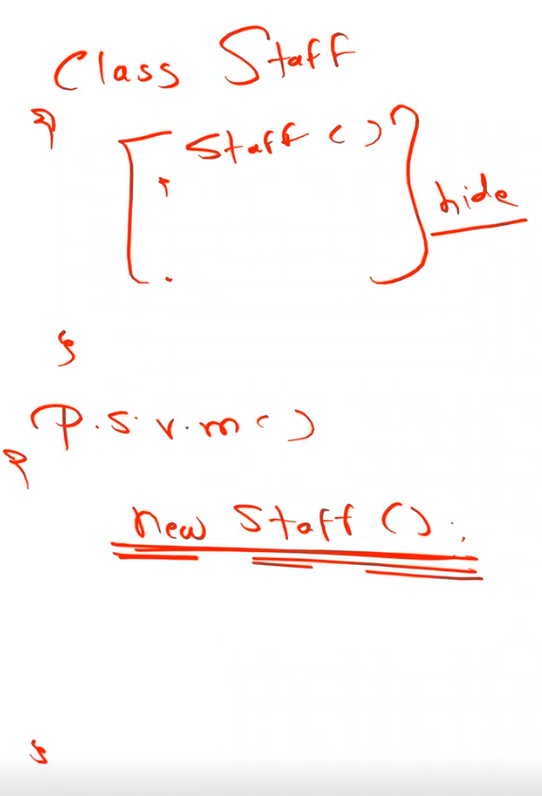
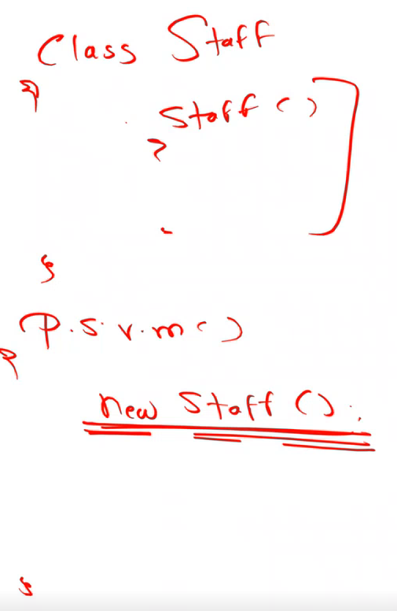
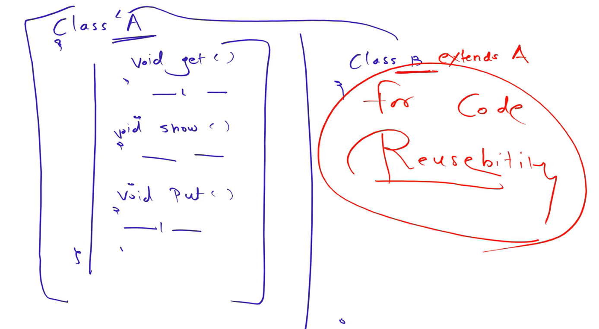
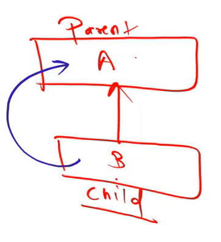
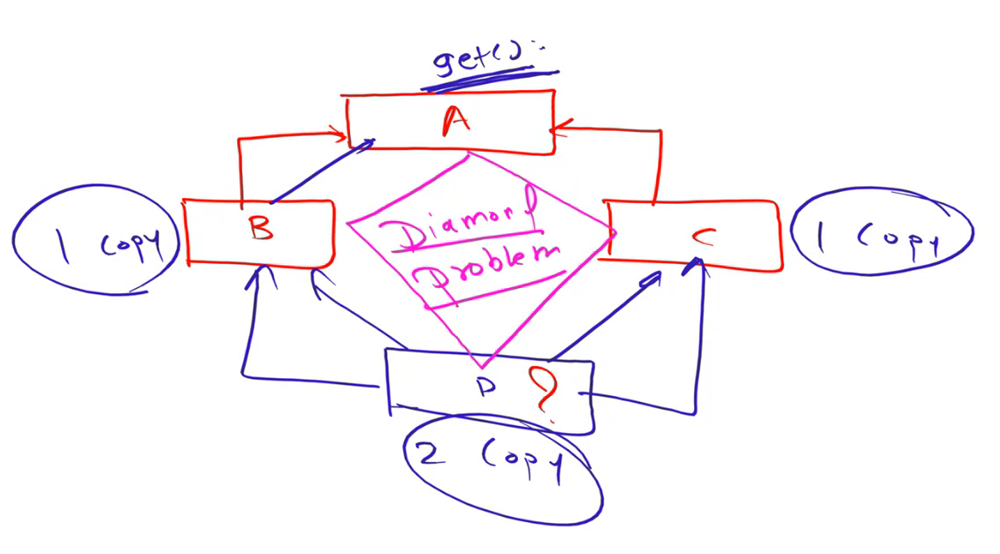
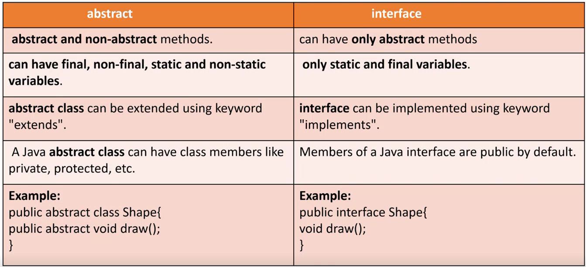
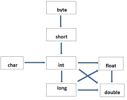
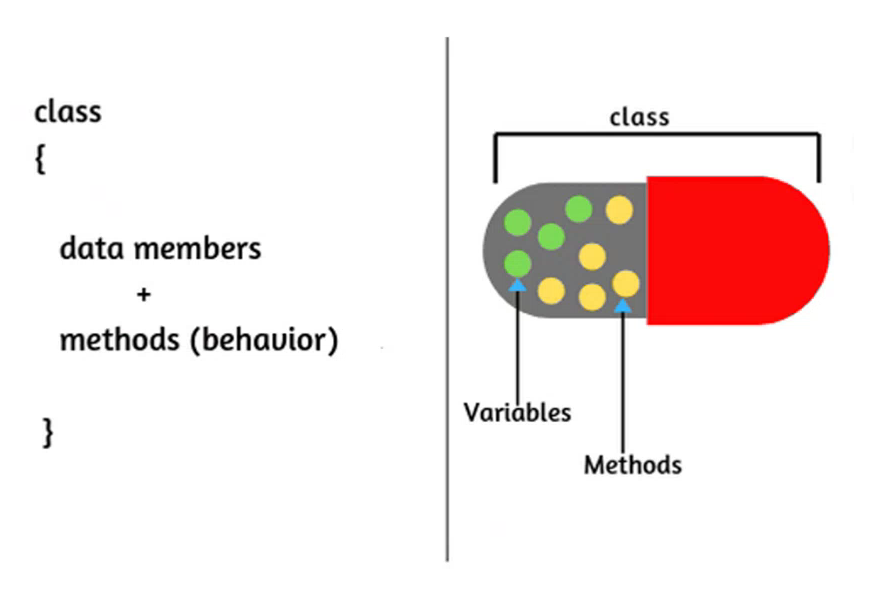

# OOPs - Object Oriented Programming

- Java is not 100% Object Oriented.
- Because, We Use Premitive Datatypes Directly. 
- Wrapper Classes -> (Integer, Character, Float, Double, Boolean, String)

| Wrapper Classes | Datatypes |
| ---- | ---- |
| Integer |  int |
| Character | char |
| Float  | float |
| Double  | double |
| Boolean | bool |
| String  | String |

- If Java where 100% Object Oriented then a variable can only be defined as "Integer a = new Integer(10);"
  ,But We can define it as "int a = 10;"
- Methodologies :- Functional Programming, **Object Oriented Programming**, Aspect Oriented Programming, Procedural Programming.
-  OOP :- A way to design program.


## OOPs :- 
(main Pillars -)
1. Class & Object
2. Inheritance
3. Abstraction
4. Polymorphism
5. Encapsulation


### 1. Class & Object
- Class : 
  - Class is a collection of objects.
  - It is not a real world entity or it is logical entity.
  - Class does not occupy memory.
  - Class is the blueprint of Object.
  - Syntax :
```sh
class Bird{
  [Methods]
  [Constructor]
}
```


- Methods:
  - It is a block of code which performs particular task.
- Syntax :
```sh
class Bird{
  void eating(){
    // Task 
  }
}
```
- Object:
  - Object is an instance of the Class.
  - Object is a real world entity or a physical entity as well.
  - It occupies the memory.
  - To access any method of a class, we are required to create an Object of that class.
  - **new** keyword is used to create an object in Java.
- Syntax :
```sh
class Bird{
  void eating(){
    // Task 
  }
}

Bird myObj = new Bird(); // Object Creation
myObj.eating(); // Method Calling
```


Example :-

```sh
class Bird{           // Class
  void eating(){      // Method 1
      Syso("Eating Food");
  }     
  void running(){     // Method 2
      Syso("Running");
  }         

  P.S.V.M(){
    Bird b1 = new Bird();  // Object
    b1.eating();      // Method Calling
  }

}
```


```sh
package day10_03Sept;


class Animal{    // Class
	void eating() {    // Method 1
		System.out.println("Eating some Food");
	}
	void sleeping() {    // Method 2
		System.out.println("Sleeping Now");
	}
	void running() {    // Method 3
		System.out.println("Running Now");
	}
}


public class class_object_method {

	public static void main(String[] args) {
		Animal dog = new Animal();	// Object
		dog.eating();	// Method Calling 
		dog.running();	// Method Calling 
		dog.sleeping();	// Method Calling 
		
	}

}


- Output :
Eating some Food
Running Now
Sleeping Now

```


### Constructor
- Constructor is same as method.
- It has same name as its class name.
- It does not have any return type.
- It gets automatically called as object is created.
- 
- Example :-
```sh
package day11_04Sept;

class Dhule{
	Dhule(){
		System.out.println("Welcome to Dhule !!!");
	}
}


public class demo_constructor {

	public static void main(String[] args) {
		new Dhule();
    Dhule d1 = new Dhule();
    
	}
}


- Output :
Welcome to Dhule !!!
Welcome to Dhule !!!

```

#### Need of Constructor 


#### Types of Constructor 
1. Default Constructor (by JVM)
  - Present in JVM, used to default system initiate.
  
2. Default Constructor
  - Made by User, It takes the place of default system constructor and works to initiate.
  
3. Parameterised Constructor
  - Parameters are passed while creating object.
4. Copy Constructor 
  - It is not used in Java. It is based on Pointers concept which is not present in Java.

- Example:
```sh
package day10_03Sept;

class default_jvm{}

class default_user{
	default_user(){
		int a = 10;
		System.out.println(" a = "+a);
	}
}

class parameterised_constructor{
	parameterised_constructor(int x, String y){
		System.out.println(" X = " + x); 
		System.out.println(" Y = " + y);
	}
	parameterised_constructor(int x){
		System.out.println(" X = " + x); 
	}
}

public class demo_types_of_constructor {

	public static void main(String[] args) {

		new default_jvm();
		new default_user();
		new parameterised_constructor(10,"Rushi");
		new parameterised_constructor(100);
		
	}

}


- Output :
 a = 10
 X = 10
 Y = Rushi
 X = 100

```


- Example with User Input :
``` sh
package day10_03Sept;
import java.util.*;

class parameterised_constructor1{
	int sid;
	String sname;
	parameterised_constructor1(int x, String y){
		sid = x;
		sname = y;
	}
	
	void display() {
		System.out.println("Student id : " + sid);
		System.out.println("Enter Student id : " + sname);
	}
}


public class parameterised_constructor_with_user_input {

	public static void main(String[] args) {

		int a;
		String b;
		Scanner s1 = new Scanner(System.in);
		System.out.println("Enter Student id :");
		a = s1.nextInt();
		System.out.println("Enter Student Name :");
		b = s1.next();
		
		parameterised_constructor1 p1 = new parameterised_constructor1(a,b);
		p1.display();
		
		
		
	}

}


- Output :
Enter Student id :
100
Enter Student Name :
Rushi
Student id : 100
Enter Student id : Rushi

```


### 2. Inheritance
- **extends** keyword is used to implement Inheritance.
- Parent & Child Relationship. (Is-A relationship -> Blood Relationship)
- Child class acquires(access) all the properties & behaviour of the Parent Class as well as it own too.



```sh

// Parent class == Base Class == Super Class
// Child class == Derived Class == Sub Class

class Parent{  
	void home(){
	   // ------
	}
}

class Child extends Parent{
	// Child class can acces methods on Parent class.
}
```
#### Advantage of Inheritance
- Code Reuseability
#### Disadvantage of Inheritance
- Tightly Coupled (joined) -> Results in slow working of application. (if parent has 100+ methods -> Child accesses all methods)

#### Types of Inheritance
1. Single Inheritance  :  A <- B (One Child - One Parent)
2. MultiLevel Inheritance  :  College <- Student <- Exam <- Result  (Multiple Levels of Single Inheritance)
3. Multiple Inheritance  :  A,B,C,D <- E  (Multiple Parent - One Child)    -----{Not supported/Possible in Java -> Ambiguity Problem & Diamond Problem} 
4. Heirarchical Inheritance  :  A <- B,C,D,E   (One parent - One Child)
5. Hybrid Inheritance : Combination of more than 1 Type of Inheritance.

- Example :
```sh
package day12_05Sept;

class College{
	void get() {
		System.out.println("College Name is SVKM");
	}
	void show() {
		System.out.println("Good Morning");
	}
}

class Student extends College{
	void display() {
		System.out.println("Hello Online Students !!!");
	}
	
}

public class demo_inheritance {

	public static void main(String[] args) {
		
		Student s1 = new Student();
		s1.get();
		s1.show();
		s1.display();
	}

}


- Output :
College Name is SVKM
Good Morning
Hello Online Students !!!

```

### 3. Abstraction
- It hides the internal details & showing only functionality to the user.
- 2 Ways to achieve Abstraction
  1. Interface
  2. Abstract Class

#### (1) Interface : 
- To Achieve Multiple Inheritance we can use Interface.
.png)
- Through Interface we can achieve 100% abstraction.
- Syntax :
```sh
interface A{
	void billing();   <- Abstract Method (The Method with No Body)
	void print();   <- Abstract Method
	void result();   <- Abstract Method
}
```
- Interface has only Abstract Method, no method Body.
- Then How will the process perform tasks ? As Follows :-
- Implementation of the processes will be in Sub-Class (Class B).
- If Class B **implements** Interface A, then Class B must implement all processes defined in Interface A.
```sh  
interface A{
	void billing();   <- Abstract Method (The Method with No Body) + Public Method
	void print();   <- Abstract Method
	void result();   <- Abstract Method
}
class B implements A{
	void billing(){
		--- Body ---
	}
	void print(){
		--- Body ---
	}
	void result(){
		--- Body ---
	}
	
}
```

- Can we write the method body inside the interface ?
> It is the feature of JDK-8 and above, we can write Default Method in the interface. 
- Can we create the Object of Interface ?
> No we can't, it does not have a body.
> We can create reference of Interface, but with it we have to make object of Child Class of interface.


- Example :
```sh
package day13_06Sept;

interface Client1{
	void billing();
}

interface Client2{
	void billing();
}

interface Client3{
	void billing();
}

class Developer implements Client1, Client2, Client3{
	public void billing(){
		int a = 10, b = 20, c;
		c = a + b;
		System.out.println("Addition is " + c);
	}
}

public class demo2 {

	public static void main(String[] args) {
		Developer d1 = new Developer();
		d1.billing();
		Client1 c1 = new Developer();
		c1.billing();
	}

}


- Output :
Addition is 30
Addition is 30


=================================OR===============================


package day13_06Sept;

interface Client1{
	void billing();
}

interface Client2 extends Client1{
	void billing();
}

interface Client3 extends Client2{
	void billing();
}

class Developer implements Client3{
	public void billing(){
		int a = 10, b = 20, c;
		c = a + b;
		System.out.println("Addition is " + c);
	}
}


public class demo2 {

	public static void main(String[] args) {
		Developer d1 = new Developer();
		d1.billing();
		Client1 c1 = new Developer();
		c1.billing();
	}

}

- Output :
Addition is 30
Addition is 30

```


#### (2) Abstract Class :
```sh
package day13_06Sept;

abstract class RBI1{
	abstract void netbanking(); // Public + Abstract Method
	abstract void payment();
	public void rules(){
		System.out.println("Office time 1000 to 1700");		
		System.out.println("Lunch time 1230 to 1330");		
		System.out.println("Sunday Off");		
	}
}

class SBI1 extends RBI1{
	public void netbanking() {
		System.out.println("This is SBI Netbanking");
	}
	public void payment() {
		System.out.println("Payment by UPI");		
	}
}


class HDFC extends RBI1{
	public void netbanking() {
		System.out.println("This is HDFC Netbanking");
	}
	public void payment() {
		System.out.println("Payment in Cash");		
	}
}


public class demo_AbstractClass {

	public static void main(String[] args) {
		SBI1 s1 = new SBI1();
		s1.netbanking();
		s1.payment();
		s1.rules();
		
		HDFC h1 = new HDFC();
		h1.netbanking();
		h1.payment();
		h1.rules();
		
	}
}

- Output :
This is SBI Netbanking
Payment by UPI
Office time 1000 to 1700
Lunch time 1230 to 1330
Sunday Off
This is HDFC Netbanking
Payment in Cash
Office time 1000 to 1700
Lunch time 1230 to 1330
Sunday Off
```


#### Interface vs Abstract Class


| Interface | Abstract Class |
| ---- | ---- |
| 100% Abstraction | Partial Abstraction |
| Abstract Methods only  not method body | Abstract Methods as well as Non-Abstract methods |
| **implements** keywords |  **extends** keywords |



### 4. Polymorphism
- Poly -> Many ; Morphism -> Forms ==> Polymorphism - Many Forms
- One thing can behave multiple operations.
#### Types of Polymorphism :
1. **Compile time Polymorphism (Static Polymorphism)** 
	- Handled by Compiler
	- Method Overloading:
    	- Multiple methods in same class with same name but different parameters.
    	- Rules of Method Overloading :
          	- Same Class
          	- Multiple Methods with same name
          	- Different Parameters
          	- Different Datatypes
          	- Change in sequence of parameters
      	- Method Overloading can not be achieved with return type.
      	- Type promotion is done while doing method overloading in Java. When the datatype is not the same then we promote one datatype to another datatype. We cannot de-promote one datatype to another datatype.
		
      	- According to the figure:
			a. byte can be promoted to <byte - short - int - long - float - double>.
			b. short can be promoted to <short - int - long - float - double>.
			c. int can be promoted to <int - long - float - double>.
			d. long can be promoted to <long - float - double>.
			e. char can be promoted to <char - int - long - float - double>.
			f. float can be promoted to <float - double>.
    	- Example :-
```sh
package day17_12Sept;

class Sample {
    void get() {
        System.out.println("Method Overloading");
    }

    void get(int x) {
        System.out.println("Value of X : " + x);
    }

    void get(float x) {
        System.out.println("Value of X : " + x);
    }

    void get(int x, String y) {
        System.out.println("Value of X : " + x + "  & Y : " + y);
    }

    void get(String y, int x) {
        System.out.println("Value of X : " + x + "  & Y : " + y);
    }
}

public class demo_method_overloading {
    public static void main(String[] args) {
        Sample s1 = new Sample();
        s1.get();          // Calls get()
        s1.get(5);         // Calls get(int x)
        s1.get(3.14f);     // Calls get(float x) - Using 'f' to indicate float
        s1.get(2, "ABC");  // Calls get(int x, String y)
        s1.get("ABC", 3);  // Calls get(String y, int x)
    }
}

- Output :
Method Overloading
Value of X : 5
Value of X : 3.14
Value of X : 2  & Y : ABC
Value of X : 3  & Y : ABC
```
		- Method Overloading can also be done for Main method.
```sh
package day17_12Sept;

public class demo_main_MethodOverloading {

	public static void main(String[] args) {
		
		System.out.println("Welcome");
		main(8);

	}	
	public static void main(int x) {
		System.out.println("Value : " + x);
	}

}

- Output :
Welcome
Value : 8
```


1. **Run time Polymorphism (Dynamic Polymorphism)**
   - Handled by JVM
   - Method Overriding:
    	- Differenct class but methods with same name and same parameters.
    	- sub(Child) class has same method as declared in the parent(super) class. 
    	- Rules of Method Overloading :
          	- Different Class
          	- Same name as in the parent class
          	- Same Parameters and Same Datatypes
          	- No Change in sequence of parameters
          	- Must be IS-A relationship (Inheritance)
```sh
In Java, we have two types of relationship:
  Is-A relationship: Whenever one class inherits another class, it is called an IS-A relationship.
  Has-A relationship: Whenever an instance of one class is used in another class, it is called HAS-A relationship.
```

		- Need of Method Overloading : To Change the definition of Child Class.
```sh
package day17_12Sept;

class A{
	void get() {
		int a = 10, b = 20, c ;
		c = a + b ;
		System.out.println("Addititon : " + c);
	}
}

class B extends A{
	void get() {
		super.get();   // To access parent method.
		int a = 9, b = 2, c ;
		c = a - b ;
		System.out.println("Substraction : " + c);
	}
}


public class demo_method_overriding {

	public static void main(String[] args) {
		
		B b1 = new B();
		b1.get();

	}

}


- Output :
Addititon : 30
Substraction : 7

```

		- Method overriding is possible with Public Access modifier.
		- Method overriding is not possible with return type.

### 5. Encapsulation
- Encapsulation == Data Hiding
- Process of Wrapping of code & data together into a single unit.
- We can create a fully encapsulated class in Java by making all the data members of the class private.
- We can use setter and getter methods to set and get the data in it. 

- Example :
```sh
package day18_13Sept;

class employee{
	private int eid ;
	public void set(int x) {
		eid = x;
	}
	public int get() {
		return eid;
	}
}

public class demo_encapsulation {

	public static void main(String[] args) {
		employee e1 = new employee();
		e1.set(101);
		int eid = e1.get();
		System.out.println("Value of eid : " + eid);
	}

}

- Output:
Value of eid : 101
```

#### Rules of Encapsulation :
	- Data Private.
	- Apply getter and setter for act to private data.


