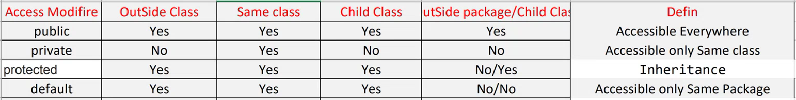
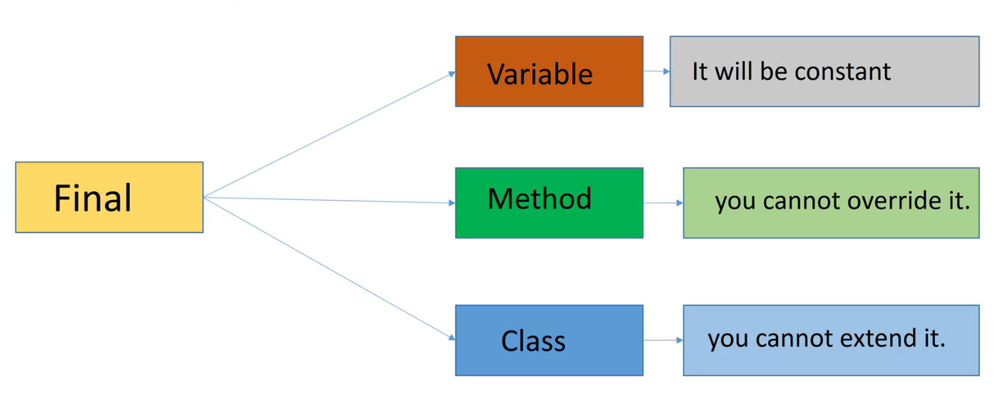

# Keywords

1. Access Modifier
2. This Keyword
3. Static 
4. Super
5. Final


## 1. Access Modifier
- Controls the access to the process.

| Access Modifier | Outside the class | Same Class | Child Class | Outside Package/ + Child Class |  |
| -------- | -------- | -------- | -------- | -------- | -------- |
| **Public** | Yes | Yes | Yes | Yes | Accessible Everywhere |
| **Private** | No | Yes | No | No | Accessible Only in Same Class |
| **Protected** | Yes | Yes | Yes | No/Yes | Accessible within the package and outside the package but through inheritance only. |
| **default** (No Access Modifier) | Yes | Yes | Yes | No/No | Accessible Only in Same Package |




## 2. This Keyword
- This keyword is referred to Instance Variable in Current Class.
- To resolve confusion between Instance Variables and Local Variables 
- this: Java this keyword can be used to refer the current object in a method or constructor.

- Example :-
1. // This Variable
```sh
package day14_09Sept;

// This Variable
class College_{
	int cid; // Instance Variable 1
	String cname; // Instance Variable 2
	void get(int X, String Y) { // X,Y : Local Variables
		cid = X; 
		cname = Y;
	}
	void display() {
		System.out.println("College Id :" + cid);
		System.out.println("College Name :" + cname);
	}
}

class Department{
	int cid; // Instance Variable 1
	String cname; // Instance Variable 2
	void get(int cid, String cname) { // cid, cname : Local Variables
		cid = cid; 
		cname = cname;
	
	}
	void display() {
		System.out.println("College Id :" + cid);
		System.out.println("College Name :" + cname);
	}
}

class Department_{
	int cid; // Instance Variable 1
	String cname; // Instance Variable 2
	void get(int cid, String cname) { // cid, cname : Local Variables
		this.cid = cid;     // this.cid <- Refers to Instance Variable 1 of the Class
		this.cname = cname; // this.cname <- Refers to Instance Variable 2 of the Class
	
	}
	void display() {
		System.out.println("College Id :" + cid);
		System.out.println("College Name :" + cname);
	}
}

public class demo_This_keyword {

	public static void main(String[] args) {

		College_ c1 = new College_();
		c1.get(101,"SVKM");
		c1.display();
		

		Department d1 = new Department();
		d1.get(102,"DYP");
		d1.display();		

		Department_ d0 = new Department_();
		d0.get(102,"DYP");
		d0.display();
	}

}


- Output :-
College Id :101
College Name :SVKM
College Id :0
College Name :null
College Id :102
College Name :DYP

```
2. // This Method

```sh
package day14_09Sept;

// This Method
// if you don't use 'this' keyword, compiler automatically sets 'this' keyword while invoking the method.

class Staff{
	public void display(){
		System.out.println("Welcome");
		this.show();
		show();
	}
	public void show() {
		System.out.println("Staff name : Rushikesh");
	}
}


public class demo2_This_keyword {

	public static void main(String[] args) {

		Staff s1 = new Staff();
		s1.display();
	}

}


- Output:-
Welcome
Staff name : Rushikesh
Staff name : Rushikesh

```

3. // This Constructor
```sh
package day14_09Sept;

//This Method
//if you don't use 'this' keyword, compiler automatically sets 'this' keyword while invoking the method.

class AC{
	AC(int X){
		System.out.println("Value of X :" + X);
	}
	AC() {
		this(5);
		System.out.println("Hello");
	}
}


public class demo3_This_keyword_Constructor {

	public static void main(String[] args) {
		
		new AC();
	}

}


- Output :- 
Value of X :5
Hello
```


## 3. Static
- Static Keyword is used of 'Memory Management'.
- Common property of every object.
- It is only applied to Instance Variable only, not to local variable.
1. Static Variable
- Example :-
```sh
package day15_10Sept;

class Student{
	int sid;
	String sname;
	static String iname = "Fortune";
	
	Student(int sid, String sname){
		this.sid = sid;
		this.sname = sname;
	}
	void display() {
		System.out.println("Student Id : " + sid);
		System.out.println("Student Name : " + sname);
		System.out.println("Student Institute Name : " + iname);
	}
}


public class demo_static {

	public static void main(String[] args) {

		Student s1 = new Student(101, "Rushi");
		s1.display();
		
		Student s2 = new Student(102, "Yash");
		s2.display();

		Student s3 = new Student(103, "Chetan");
		s3.display();
	}

}

- Output :-
Student Id : 101
Student Name : Rushi
Student Institute Name : Fortune
Student Id : 102
Student Name : Yash
Student Institute Name : Fortune
Student Id : 103
Student Name : Chetan
Student Institute Name : Fortune

```

- Static Data belongs to Class not for Object.
- Example :-
```sh
package day15_10Sept;

class TV{
	int x = 1;
	TV(){
		x = x + 1 ;
		System.out.println("Value of X :" + x);
		
	}
}

class TV_{
	static int x = 1;
	TV_(){
		x = x + 1 ;
		System.out.println("Value of X :" + x);
		
	}
}

public class demo2_static {

	public static void main(String[] args) {

		new TV();
		new TV();

		new TV_();
		new TV_();

	}

}

- Output :-
Value of X :2
Value of X :2
Value of X :2
Value of X :3
```

2. Static Method:
- No  need to create object of the class, we can directly call using class name.
```sh
package day15_10Sept;

class ABC{
	static void get() {    // Static Method
		System.out.println("Hello");
	}

	void show() {     //Non-Static Method
		System.out.println("Good Morning");
	}
}

public class demo3_static {

	public static void main(String[] args) {
		
		ABC.get();		    // Calling Static Method
		ABC o1 = new ABC();
		o1.show();		    // Calling Non-Static Method by Creating Object
		
	}

}

- Object :
Hello
Good Morning

```


3. Static Block :
- Static Block is executed when the class load in the memory.
- It executes before the main method at the time of class loading.
```sh
package day15_10Sept;

class ABCD{
	static {    
		System.out.println("This is Static Block");
	}
}


public class demo4_StaticBlock {

	public static void main(String[] args) {
		
		ABCD o1 = new ABCD();

		System.out.println("This is Main Method Block");
		
	}

}


- Output :
This is Static Block
This is Main Method Block
```
- Multiple Static Blocks can be written in a Program.


## 4. Super
- Super Keyword can only be used in Inheritance.
- Super Keyword refers to Superclass(parent) objects.
- It is used to call the superclass methods and to access the superclass constructor.
- The most common use of the Super Keyword is to eliminate the confusion between SuperClasses and SubClasses that have methods with the same name.
- The Super keyword in Java is a reference variable which is used to refer immediate parent class object.
- Super Keyword work for only extreme previous SuperClass.

1. Super Variable :
   - Access the data member or field of parent class.
   - It is used if parent class and child class have same field. 
```sh
package day16_11Sept;

class College{
	String name = "SVKM";
}

class Student extends College{
	String name = "SSVPS";
	
	public void display() {
		// Data from Current class
		System.out.println("College Name is " + name); 
	}
	public void display_parent() {
		// Data from Super(Parent) Class.
		System.out.println("College Name is " + super.name); 
	}
}


public class demo_Super {

	public static void main(String[] args) {

		Student s1 = new Student();
		s1.display();
		s1.display_parent();
	}

}


- Output :
College Name is SSVPS
College Name is SVKM
```

2. Super Method :
```sh
package day16_11Sept;

class College1{
	public void display() {
		System.out.println("Super Class Method"); 
	}
}

class Student1 extends College1{
	public void display() {
		super.display();
		System.out.println("Sub-Class Method"); 
	}
}


public class demo2_SuperMethod {

	public static void main(String[] args) {

		Student1 s1 = new Student1();
		s1.display();
	}

}

- Output :
Super Class Method
Sub-Class Method
```

3. Super Constructor :
   - In Super Constructor, 'super();' is not mandatorily required to be written, Compiler automatically executes super(parent) class constructor.
```sh
package day16_11Sept;

class A{
	A() {
		System.out.println("Super Class Constructor"); 
	}
}

class B extends A{
	B() {
		super();
		System.out.println("Sub-Class Constructor"); 
	}
}

public class demo3_StaticConstructor {
	public static void main(String[] args) {	
		new B();
	}
}


- Object :
Super Class Constructor
Sub-Class Constructor
```

## 5. Final

1. Final Variable
   - Constant Variable. (Value can not be changed)
2. Final Method
   - We can not override it.
3. Final Class
   - We can not extend it. (Interitance can not be applied on this class) 
   - It cannot work as parent(super) class.


 
  