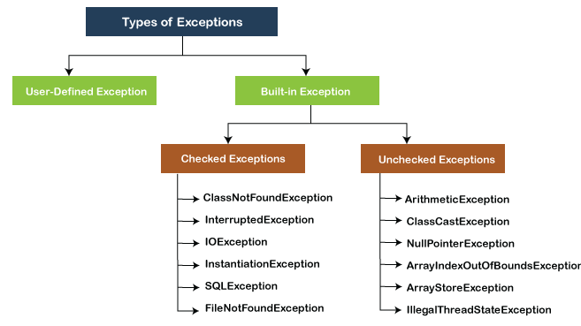
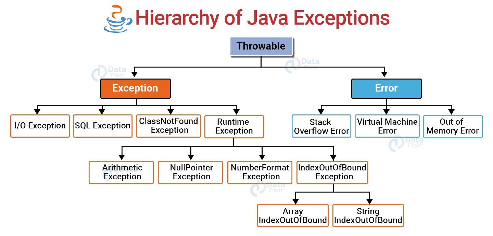
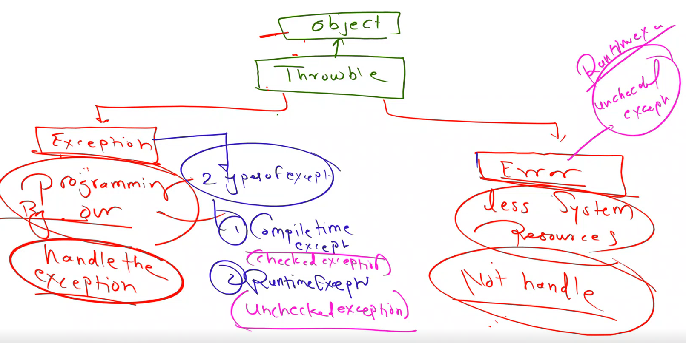
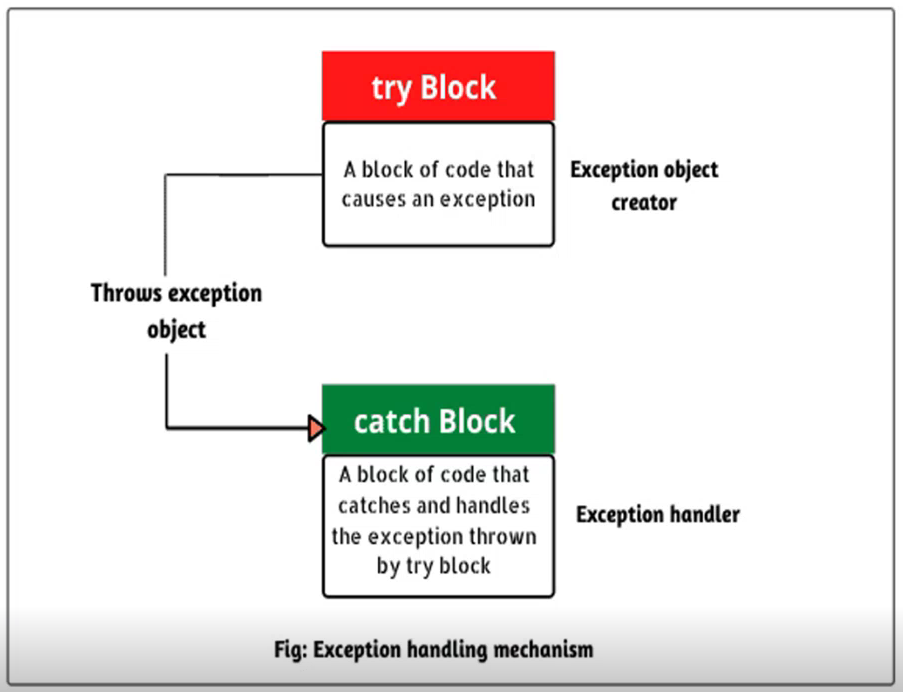

# Exception Handling in Java

1. What is Exception
2. how to handle the exception
3. Types of Exception
4. Different Types of Exception
5. Handling the Exception by Try and Catch block


## What is Exception
- Exception : An unexpected/unwanted event occured during the execution of the program.
- A Disturbance in the Flow.
- Handling : Finding an alternate way to resolve exception.

## Types of Exceptions


## Heirarchy of Exception Handling


## Exception vs Error

| Exception | Error |
| --------- | --------- |
| Reason : Programming | Reason : Less System resources |
| Can be handled | Can not be Handled |

### Types :
#### 1. Exception :
1. Compile Time Exception (Checked Exception)
2. Run Time Exception (Unchecked Exception)
#### 2. Error :
1. Run Time Error (Unchecked Exception)




### Examples :- 

- Example 1 :
```sh
package day19_18Sept;
public class demo_exception_handling {
	public static void main(String[] args) {
		int a = 20, b = 0, c;
		c = a/b;
		System.out.println("Div : " + c);
		System.out.println("Welcome to Dhule");
	} 
}

- Exception Output :
demo_exception_handling [Java Application]	
	day19_18Sept.demo_exception_handling at localhost:8569	
		Thread [main] (Suspended (uncaught exception ArithmeticException))	
			demo_exception_handling.main(String[]) line: 7	
	C:\Users\HP\.p2\pool\plugins\org.eclipse.justj.openjdk.hotspot.jre.full.win32.x86_64_21.0.4.v20240802-1551\jre\bin\javaw.exe (26-Oct-2024, 2:29:28 am) [pid: 13112]	


-> Exception Handling :

package day19_18Sept;
public class demo_exception_handling {
	public static void main(String[] args) {
		int a = 20, b = 0, c;
		try {
			c = a/b;
			System.out.println("Div : " + c);			
		}
		catch (ArithmeticException e){
			System.out.println("Please Change the Value of B");			
		}
		System.out.println("Welcome to Dhule");
	} 
}

- Output :- 
Please Change the Value of B
Welcome to Dhule
```

- Example 2 :
```sh
package day19_18Sept;
public class demo1_exception_handling {
	public static void main(String[] args) {
		String x = null ;
		System.out.println(x.length());
		int a = 10 , b = 20 , c ;
		c = a + b;
		System.out.println("Addition : " + c);
	}
}

- Exception Output :
demo1_exception_handling [Java Application]	
	day19_18Sept.demo1_exception_handling at localhost:8743	
		Thread [main] (Suspended (uncaught exception NullPointerException))	
			demo1_exception_handling.main(String[]) line: 5	
	C:\Users\HP\.p2\pool\plugins\org.eclipse.justj.openjdk.hotspot.jre.full.win32.x86_64_21.0.4.v20240802-1551\jre\bin\javaw.exe (26-Oct-2024, 2:45:37 am) [pid: 17420]	

-> Exception Handling :
package day19_18Sept;
public class demo1_exception_handling {
	public static void main(String[] args) {
		try {
			String x = null ;
			System.out.println(x.length());			
		}
		catch(NullPointerException e) {
			System.out.println("String x is Null");
		}
		int a = 10 , b = 20 , c ;
		c = a + b;
		System.out.println("Addition : " + c);
	}
}

- Output :
String x is Null
Addition : 30
```


> In **catch(Exception_type e){}** block if Exception type is not known :- we can write **catch(Exception e){}** - Exception is the parent class of all types of exceptions. 


## Java Exception Keywords :
1. try
2. catch
3. finally
4. throw
5. throws

### 1.,2. try-catch block :

- Only one Exception can be handled by a Try-Catch Block. 
```sh
package day21_12Nov;

public class demo2 {

	public static void main(String[] args) {
		int a = 20, b = 0, c;
		String s1 = null;
		try {
			c = a/b;	
			System.out.println("Div is " + c);
			System.out.println(s1.length());
			
		}
		catch (Exception e) {
			System.out.println(e);
		}
	}
}

Output :- 
java.lang.ArithmeticException: / by zero
```
- Multiple Catch blocks can be written for single Try block, but the Exception occuring first will only get Handled.
```sh
package day21_12Nov;

public class demo2 {

	public static void main(String[] args) {
		int a = 20, b = 0, c;
		String s1 = null;
		try {
			System.out.println(s1.length());
			c = a/b;	
			System.out.println("Div is " + c);
			
		}
		catch (Exception e) {
			System.out.println(e);
		}
		catch (NullPointerException e) {
			System.out.println(e);
		}
	}
}

Output :-
java.lang.NullPointerException: Cannot invoke "String.length()" because "s1" is null
```
- To handle multiple exception, its better to write multiple try-catch block independently for each exception.
```sh
package day21_12Nov;

public class demo3 {

	public static void main(String[] args) {
		int a = 20, b = 0, c;
		try {
			c = a/b;	
			System.out.println("Div is " + c);
			
		}
		catch (ArithmeticException e) {
			System.out.println(e);
		}
		
		String s1 = null;
		
		try {
			System.out.println(s1.length());	
		}
		catch (NullPointerException e) {
			System.out.println(e);
		}
	}
}

Output :-
java.lang.ArithmeticException: / by zero
java.lang.NullPointerException: Cannot invoke "String.length()" because "s1" is null
```

### 3. Finally block :
  - Finally block is always gets executed doesn't matters it exception occured or not also it is handled or not.		
  - It is always executed whether the exception is being handled or not.
  - Try block or Try-Catch block is mandatory before Finally block (Because Finally Block follows Try and Catch Block).
  - Only one Finally block is allowed in a Class.
  - Main Use of finally is to Close the DataBase or File related Operation.
  - Syntax
```sh
		try{
		}
		catch () {

		}
		finally{
		}
```
- Example :-
1. Try -> Finally (In this case, the exception occures but does not get handled [Because Catch block is not present] ).
```sh
package day21_12Nov;

public class demo_finally_block {

	public static void main(String[] args) {

		String s1= null;
		try {
			System.out.println(s1.length());
		}
		finally {
			System.out.println("Finally Block !!!");
		}
	}

}

Output :-
demo_finally_block [Java Application]	
	day21_12Nov.demo_finally_block at localhost:5857	
		Thread [main] (Suspended (uncaught exception NullPointerException))	
			demo_finally_block.main(String[]) line: 13	
	C:\Users\HP\.p2\pool\plugins\org.eclipse.justj.openjdk.hotspot.jre.full.win32.x86_64_21.0.4.v20240802-1551\jre\bin\javaw.exe (29-Nov-2024, 4:47:28 pm) [pid: 16816]	
Finally Block !!!

```
2. Try-Catch -> Finally (In this case, the exception occures and get handled).
```sh
package day21_12Nov;

public class demo_finally_block_Try_Catch {

	public static void main(String[] args) {

		String s1= null;
		try {
			System.out.println(s1.length());
		}
		catch(NullPointerException e){
			System.out.println("String Lenght is Null");				
		}
		finally {
			System.out.println("Finally Block !!!");
		}
	}

}

Output :-
String Lenght is Null
Finally Block !!!x
```


### 4. Throw block :
  - Custom Exceptions (User Defined Exceptions)
  - Syntax :
```sh
		class Demo{
			p.s.v.m(){
				throw new ExceptionClassName("Exception_Message");
				// throw --> Custom Exception
			}
		}
```
  - Example (Exception Encountered);
```sh
package day20_20Sept;

public class throw_keyword {

	public static void main(String[] args) {
		
		int bank_amt = 10000, withdrawl_amt = 51000;
		
		if (bank_amt > withdrawl_amt ) {
			bank_amt = bank_amt - withdrawl_amt;
			System.out.println("Remaining Balance is " + bank_amt);
		}
		else {
			throw new ArithmeticException("Insufficient Balance");
		}
		System.out.println("Please Continue the Process");

	}

}

Output :
throw_keyword [Java Application]	
	day20_20Sept.throw_keyword at localhost:1228	
		Thread [main] (Suspended (uncaught exception ArithmeticException))	
			throw_keyword.main(String[]) line: 15	
	C:\Users\HP\.p2\pool\plugins\org.eclipse.justj.openjdk.hotspot.jre.full.win32.x86_64_21.0.4.v20240802-1551\jre\bin\javaw.exe (27-Nov-2024, 12:53:26 pm) [pid: 13052]	


// --------------------------------------------------------------------------------------

package day20_20Sept;

class Checking_the_Exception extends RuntimeException{
	public Checking_the_Exception(String S){
		super(S);
	}
}

public class throw_keyword {

	public static void main(String[] args) {
		// TODO Auto-generated method stub

		int bank_amt = 10000, withdrawl_amt = 51000;
		
		if (bank_amt > withdrawl_amt ) {
			bank_amt = bank_amt - withdrawl_amt;
			System.out.println("Remaining Balance is " + bank_amt);
		}
		else {
			throw new Checking_the_Exception("Insufficient Balance");
		}
		System.out.println("Please Continue the Process");

	}

}

Output :
throw_keyword [Java Application]	
	day20_20Sept.throw_keyword at localhost:1294	
		Thread [main] (Suspended (uncaught exception Checking_the_Exception))	
			throw_keyword.main(String[]) line: 22	
	C:\Users\HP\.p2\pool\plugins\org.eclipse.justj.openjdk.hotspot.jre.full.win32.x86_64_21.0.4.v20240802-1551\jre\bin\javaw.exe (27-Nov-2024, 12:59:31 pm) [pid: 10484]	

```

  - Example (Exception Handled);
```sh
package day20_20Sept;

class Checking_the_Exception extends RuntimeException{
	public Checking_the_Exception(String S){
		super(S);
	}
}

public class throw_keyword {

	public static void main(String[] args) {
		// TODO Auto-generated method stub

		int bank_amt = 10000, withdrawl_amt = 51000;
		
		if (bank_amt > withdrawl_amt ) {
			bank_amt = bank_amt - withdrawl_amt;
			System.out.println("Remaining Balance is " + bank_amt);
		}
		else {
			try {
				throw new Checking_the_Exception("Insufficient Balance");
			}
			catch(Checking_the_Exception e) {
				System.out.println(e);
			}
		}
		System.out.println("Please Continue the Process");

	}

}


Output :
day20_20Sept.Checking_the_Exception: Insufficient Balance
Please Continue the Process

```

   - Example :
```sh
package day20_20Sept;
import java.util.*;

class Number_Less_Than_Zero extends RuntimeException{
	public Number_Less_Than_Zero(String S){
		super(S);
	}
}


public class demo {

	public static void main(String[] args) {
		// TODO Auto-generated method stub
		int num;
		
		Scanner s1 = new Scanner(System.in);
		System.out.print("Enter a number : ");
		num = s1.nextInt();
		
		if (num >= 0) {
			System.out.println(num + " is Greater than or Equal to Zero");
		}
		else {
			try {
				throw new Number_Less_Than_Zero("Number Less Than Zero");
			}
			catch(Number_Less_Than_Zero e) {
				System.out.println(e);
			}
		}
		System.out.println("Please Continue the Process");

	}

}


Output : 
Enter a number : -10
day20_20Sept.Number_Less_Than_Zero: Number Less Than Zero
Please Continue the Process
```

### 5. Throws block :
- Indicates the Caller method to handle that exception a the Calling end.
- Example :
```sh
package day20_20Sept;
import java.util.Scanner;


class A{
	public void check(int a[], int n) throws ArrayIndexOutOfBoundsException{
		System.out.println(a[n]);
	}
}

public class throws_keyword {

	public static void main(String[] args) {
		// TODO Auto-generated method stub

		int a[] = { 23, 45, 67, 11, 25};
		
		A a1 = new A();
		Scanner s1 = new Scanner(System.in);
		System.out.println("Enter Index Number : ");
		int k = s1.nextInt();
		
		try {
			a1.check(a,k);
		}
		catch(Exception e) {
			System.out.println("Index Value Out of Range");
			
		}
			
		
	}

}


Output :
1.-> Enter Index Number : 
	 2
	 67

2.-> Enter Index Number : 
	 10
	 Index Value Out of Range
```
- Example2 : Multiple Exceptions
```sh
package day22_13Nov;
import java.util.*;

class A{
	public void check(int a[], int n) throws ArrayIndexOutOfBoundsException, ArithmeticException{
		System.out.println(a[n]);
		System.out.println(a[n]/a[n-1]);
	}
}

public class demo3_throws {

	public static void main(String[] args) {

		int a[] = { 23, 45, 67, 0, 11, 25};
		
		A a1 = new A();
		Scanner s1 = new Scanner(System.in);
		System.out.println("Enter Index Number : ");
		int k = s1.nextInt();
		
		try {
			a1.check(a,k);
		}
		catch(ArrayIndexOutOfBoundsException e) {
			System.out.println(e);
		}
		catch(ArithmeticException e) {
			System.out.println(e);
		}	
	}
}

Output :
1.-> Enter Index Number : 
	 4
	 11
	 java.lang.ArithmeticException: / by zero

2.-> Enter Index Number : 
	 8
	 java.lang.ArrayIndexOutOfBoundsException: Index 8 out of bounds for length 6

```

### throw vs throws :
| throw | throws |
| --------- | --------- |
| Custom Exception, User Defined Exceptions | Indicate by the Caller Method |
| Single Exception | Multiple Exception |
| Inside the method or a Block | Outside of the Method or method Signature |
| it created the Instance of the Class, Follow  by the Object | Follow by the Class | 

### Final vs Finally vs Finalize

| final | finally | finalize |
| --------- | --------- | --------- |
| Keyword | Block | Method |
| Three Ways to use - | Always get executed, exception is handled or not | It is present in Object class |
| 1. final variable : Value can not be updated | [Used in Exception Handling] | protected void finalize () {} |
| 2. final method : Definition of method can not be updated | Follows try or try-catch block | Used for GarbageCollection |
| 3. final class : can not get extend | try{} catch(){} finally{} | CleanUp code is written in it. |


