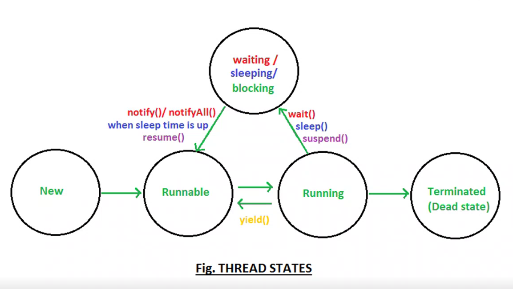

# MultiTasking 
- Multiple task work at the same time.
- Types :
  1. Process Based MultiTasking
  2. Thread Based MultiTasking

# MultiProcessing 


# MultiThreading

## Process vs Thread

| Process | Thread |
| ---------- | ---------- |
| System Level | Programming Level |
| Multiple Thread can be in a Process | Smallest Unit of a Process (Sub Process) |
| Process are Independent | Threads are Independent |


## Life Cycle of a Thread


## Ways for Creating Threads 
- 2 Ways :
1. Thread Class
2. Runnable Interface


### 1. By Extending Thread Class
- Example :
```sh
package day23_14Nov;

class Music extends Thread{
	public void run() {
		System.out.println("Thread is Running");
	}
}


public class MultiThreading_demo {

	public static void main(String[] args) {
		Music m1 = new Music();
		m1.start();
		
	}
}
Output :-
Thread is Running
```
### 2. By implementing Runnable Interface
- This is better way to create a Thread.
- Exmple :
```sh
package day23_14Nov;

class Musical implements Runnable{
	public void run() {
		System.out.print("Thread is Running by Implementing Runnable");
	}
}

public class MultiThreading_By_Implementing_Runnable_Interface {

	public static void main(String[] args) {
		Musical m0 = new Musical();
		
		Thread t1 = new Thread(m0);
		t1.start();
	}
}

Output :-
Thread is Running by Implementing Runnable
```


#### Example
- Without Threading
```sh
package day23_14Nov;

class Audio{
	void playaudio(){
		for(int i = 0 ; i < 10 ; i++) {
			System.out.println("Audio is Playing");
		}
	}
}

class Video{
	void playvideo(){
		for(int i = 0; i < 10 ; i++) {
			System.out.println("Playing Video");
		}
	}
}

class Timer{
	void playtimer(){
		for(int i = 0; i < 10 ; i++) {
			System.out.println("timmer is ON");
		}
	}
}

public class demo_without_multithreading {

	public static void main(String[] args) {
		Audio a1 = new Audio();
		a1.playaudio();
		Video v1 = new Video();
		v1.playvideo();
		Timer t1 = new Timer();
		t1.playtimer();
	}

}

Output :-
Audio is Playing
Audio is Playing
Audio is Playing
Audio is Playing
Audio is Playing
Audio is Playing
Audio is Playing
Audio is Playing
Audio is Playing
Audio is Playing
Playing Video
Playing Video
Playing Video
Playing Video
Playing Video
Playing Video
Playing Video
Playing Video
Playing Video
Playing Video
timmer is ON
timmer is ON
timmer is ON
timmer is ON
timmer is ON
timmer is ON
timmer is ON
timmer is ON
timmer is ON
timmer is ON
```
- With MultiThreading
```sh
package day23_14Nov;

class Audio_ extends Thread{
	public void run(){
		for(int i = 0 ; i < 10 ; i++) {
			System.out.println("Audio is Playing");
		}
	}
}

class Video_ extends Thread{
	public void run(){
		for(int i = 0; i < 10 ; i++) {
			System.out.println("Playing Video");
		}
	}
}

class Timer_ extends Thread{
	public void run(){
		for(int i = 0; i < 10 ; i++) {
			System.out.println("timmer is ON");
		}
	}
}

public class demo_with_multithreading {

	public static void main(String[] args) {
		Audio_ a1 = new Audio_();
		a1.start();
		Video_ v1 = new Video_();
		v1.start();
		Timer_ t1 = new Timer_();
		t1.start();
	}

}

Output :-
Audio is Playing
Playing Video
Playing Video
Playing Video
Playing Video
Playing Video
Playing Video
Playing Video
Playing Video
Playing Video
Audio is Playing
Audio is Playing
Audio is Playing
Audio is Playing
Audio is Playing
Audio is Playing
Audio is Playing
Audio is Playing
Playing Video
Audio is Playing
timmer is ON
timmer is ON
timmer is ON
timmer is ON
timmer is ON
timmer is ON
timmer is ON
timmer is ON
timmer is ON
timmer is ON
```

## Thread Priority :- 
- According to the Priority JVM allocates the Process.(Thread Scheduler)
- These Priorities are set in the form of Integer Values.
- **getPriority()** - To get the Priority Number of current process.
- **setPriority()** - To set the Priority Number to current process.
```sh
- Thread.currentThread().setPriority()
- Thread.currentThread().getPriority()
```
- Thread Priority -
  - MIN_PRIORITY (Minimum can be 1)
  - MAX_PRIORITY (Maximum can be 10)
  - NORM_PRIORITY (Default Priority is 5)
```sh
Note : Windows does not Support priority. 
```
- Example :
```sh
package day24_17Nov;

class Music extends Thread{
	public void run() {
		System.out.println("Playing Music");
		System.out.println("Priority of Music Class : " + Thread.currentThread().getPriority());
	}
}


public class thread_priority_demo {

	public static void main(String[] args) {
		System.out.println("Priority of Main Class : " + Thread.currentThread().getPriority());
		Music m1 = new Music();
		m1.start();
		Thread.currentThread().setPriority(10);
		System.out.println("Priority of Main Class after Set: " + Thread.currentThread().getPriority());
		
	}

}


Output :-
Priority of Main Class : 5
Playing Music
Priority of Main Class after Set: 10
Priority of Music Class : 5
```
- Incase Priority assigned is less than 1 or greater than 10 :- **IllegalArgumentException**

## Prevent Thread Execution Method 
1. sleep
2. yield
3. join
- Also destroy, stop, wait are methods, but are deprecated.

### 1. sleep() : 
- Pause current Thread for Specific amount of Time.
```sh
class Thread{
	public static native void sleep(int milli);
	public static void sleep(int milli, int nano);   // Both throws InterruptedException 
}
```
- Example :-
```sh
package day24_17Nov;

public class thread_sleep_function {

	public static void main(String[] args) {
		for(int i=0; i<10; i++) {
			try {
				Thread.sleep(2000);	
			}
			catch(Exception e) {
				
			}
			System.out.println("Welcome");
		}
	}
}


Output : (After every 2 seconds)
Welcome
Welcome
Welcome
Welcome
Welcome
Welcome
Welcome
Welcome
Welcome
Welcome
```
```sh
 package day24_17Nov;

public class thread_sleep_demo2 {

	public static void main(String[] args) {
		for(int sec=1; sec<=60; sec++) {
			try {
				Thread.sleep(1000);	
			}
			catch(Exception e) {
				
			}
			System.out.println("Second :" + sec);
		}
	}
}

Output :- Second from 1 to 60 after every 1 sec.
```

### 2. yield() : 
- (Jdk 1 - 5) Currently executing thread is temporarily paused & it gives chance to other waiting threads.
- (Jdk 6 +) It provides the Hint to the thread scheduler, if the request is accepted by Thread Scheduler, So output is correct. And if the request is ignored by Thread Scheduler, So output is wrong. 
```sh
class Thread{
	public final native void yield();
}
```
- Example :-
```sh
package day25_19Nov;

class Patient extends Thread{
	public void run() {
		Thread.yield();
		for(int i=0; i<5;i++) {
			System.out.println("Patient Number :" + i);
		}
	}
}

public class thread_yield_method {

	public static void main(String[] args) {

		Patient p1 = new Patient();
		p1.start();
		
		for(int i=0; i<5;i++) {
			System.out.println("Main :" + i);
		}
		
	}

}


Output :- 
Main :0
Main :1
Main :2
Main :3
Main :4
Patient Number :0
Patient Number :1
Patient Number :2
Patient Number :3
Patient Number :4
```

### 3. Join() :
- The join() method of thread class wait for a thread to die.
- It is used when you want one thread to wait for completion of another.
- Example :-
```sh
(without Join Method)
package day25_19Nov;

class counsellor extends Thread{
	public void run() {
		System.out.println("Conselling Start");
		try {
			Thread.sleep(5000);
		}
		catch(InterruptedException e) {
			e.printStackTrace();
		}
		System.out.println("Conselling End");
	}
}

class demoLec extends Thread{
	public void run() {
		System.out.println("Demo Lecture Start");
		try {
			Thread.sleep(5000);
		}
		catch(InterruptedException e) {
			e.printStackTrace();
		}
		System.out.println("Demo Lecture End");
	}
}

class addmisson extends Thread{
	public void run() {
		System.out.println("Addmisson Process Start");
		try {
			Thread.sleep(5000);
		}
		catch(InterruptedException e) {
			e.printStackTrace();
		}
		System.out.println("Addmisson Process End");
	}
}

public class thread_join_method {

	public static void main(String[] args) {
		counsellor c1 = new counsellor();
		c1.start();
		demoLec d1 = new demoLec();
		d1.start();
		addmisson a1 = new addmisson();
		a1.start();
	}

}

Output :-
Conselling Start
Demo Lecture Start
Addmisson Process Start
Demo Lecture End
Conselling End
Addmisson Process End


(With Join Method)
package day25_19Nov;

class counsellor extends Thread{
	public void run() {
		System.out.println("Conselling Start");
		try {
			Thread.sleep(5000);
		}
		catch(InterruptedException e) {
			e.printStackTrace();
		}
		System.out.println("Conselling End");
	}
}

class demoLec extends Thread{
	public void run() {
		System.out.println("Demo Lecture Start");
		try {
			Thread.sleep(5000);
		}
		catch(InterruptedException e) {
			e.printStackTrace();
		}
		System.out.println("Demo Lecture End");
	}
}

class addmisson extends Thread{
	public void run() {
		System.out.println("Addmisson Process Start");
		try {
			Thread.sleep(5000);
		}
		catch(InterruptedException e) {
			e.printStackTrace();
		}
		System.out.println("Addmisson Process End");
	}
}

public class thread_join_method{

	public static void main(String[] args) throws InterruptedException {
		counsellor c1 = new counsellor();
		c1.start();
		c1.join();
		
		demoLec d1 = new demoLec();
		d1.start();
		d1.join();
		
		addmisson a1 = new addmisson();
		a1.start();
		a1.join();
		
	}

}

Output :-
Conselling Start  (Paused for 5 sec)
Conselling End
Demo Lecture Start  (Paused for 5 sec) 
Demo Lecture End
Addmisson Process Start  (Paused for 5 sec)
Addmisson Process End
```


### sleep() vs yield() vs join()


| | sleep() | yield() | join() |
| ------- | ------- | ------- | ------- |
| **Definition** | Pause current thread for Specific amount of time. | Current Executing thread is temporarily paused and it gives chances to other waiting threads. | Completely executes the current thread. |
| **Overload** | Yes | No | Yes |
| **Static** | Yes | Yes | Yes |
| **Final** | No | No | Yes |
| **Synchronized** | No | No | Yes | 


## Synchronization 
- Method Level Synchronization.
- It is a critical concept in Critical programming that ensures multiple thread can interact with shared resources safely.
- It is the capability to control the access of multiple threads to any shared resource.
- Example :-
```sh
[Without Synchronization]
package day26_20Nov;

class Train{
	public void seatBook(int x) {
		for (int i=1; i<=10; i++) {
			System.out.println(x*i);
		}
	}
}

class Person1 extends Thread{
	Train t1;
	public Person1(Train t1) {
		this.t1 = t1;
	}
	
	public void run() {
		t1.seatBook(5);
	}
}

class Person2 extends Thread{
	Train t2;
	public Person2(Train t2) {
		this.t2 = t2;
	}
	
	public void run() {
		t2.seatBook(10);
	}
}


public class demo_synchronization {
	public static void main(String[] args) {
		Train t = new Train();

		Person1 p1 = new Person1(t);
		p1.start();
		
		Person2 p2 = new Person2(t);
		p2.start();
	}
}

Output :-
5
10
20
30
40
50
10
60
70
80
90
100
15
20
25
30
35
40
45
50


[After Synchronization]
class Train{
	public synchronized void seatBook(int x) {
		for (int i=1; i<=10; i++) {
			System.out.println(x*i);
		}
	}
}

Output :-
5
10
15
20
25
30
35
40
45
50
10
20
30
40
50
60
70
80
90
100
```

- Synchronization is slow in processing but it guarantees output consistency.
- Non-Synchronization is fast in processing but it does not guarantees output consistency.


 
